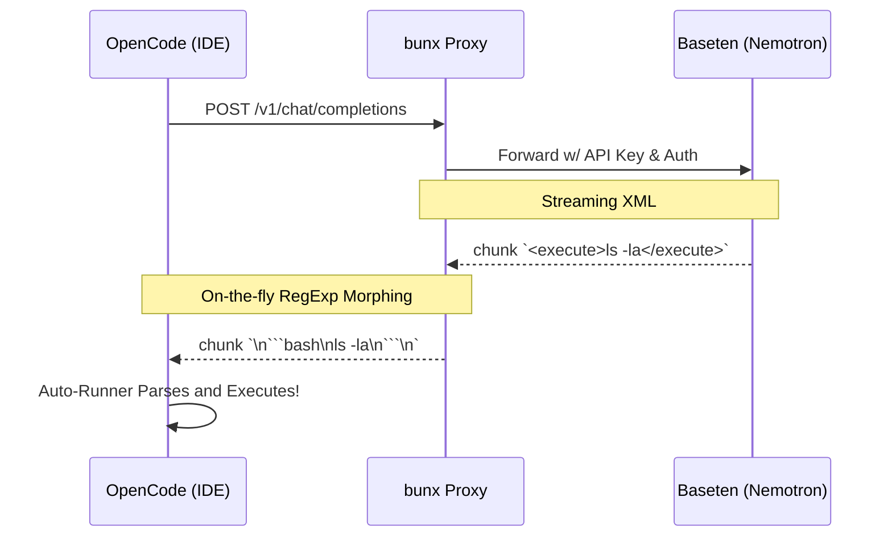

<div align="center">
  <h1>⚡️ Nemotron Baseten Provider</h1>
  <p><strong>A zero-install middleware connecting Baseten's Nemotron models natively out of the box with OpenCode.</strong></p>

  [](https://opensource.org/licenses/MIT)
  [](https://bun.sh)
  [](https://github.com/cherninlab/nemotron-baseten-provider/actions)
  [](https://www.npmjs.com/package/nemotron-baseten-provider)
</div>

<br />

## 📖 The Problem
OpenCode models natively expect standard markdown execution semantics. When interacting with Baseten's raw Nemotron API endpoint, the model wraps critical execution parameters and step-by-step reasoning within custom XML tags (e.g., `<thought>` or `<execute>`). Because OpenCode treats this as standard LLM output, it fails to parse and execute natively in the IDE out-of-the-box.

## 🚀 The Solution
This lightweight proxy sits in the middle. It exposes a local OpenAI-compatible endpoint that OpenCode dials into. It seamlessly forwards the prompt to Baseten while instantly transforming incoming streamed XML into the clean markdown codeblocks OpenCode is built to execute. 

---

## ⚡️ Zero-Install Quick Start

The easiest way to run the provider is as a native, zero-install proxy leveraging either `bunx` or `npx`.

```bash
# Using Bun (Recommended)
BASETEN_API_KEY="your_api_key" bunx nemotron-baseten-provider

# Using NPX
BASETEN_API_KEY="your_api_key" npx nemotron-baseten-provider
```

This will instantly spin up a local proxy interceptor at: **`http://localhost:3042/v1`**

### Step 2: Configure OpenCode
Simply point your environment to the proxy. In your `oh-my-opencode.json` (or standard `opencode.json`), configure your provider:
```json
{
  "models": [
    {
      "title": "Nemotron (Baseten Proxy)",
      "provider": "openai",
      "model": "nemotron-super",
      "apiBase": "http://localhost:3042/v1"
    }
  ]
}
```

---

## 🏗 Architecture & Flow



---

## 🛠 Local Development

Thinking of extending the parser for a new model? We utilize **Bun** and **Biome**.

```bash
# Clone the repository
git clone https://github.com/cherninlab/nemotron-baseten-provider.git
cd nemotron-baseten-provider

# Install blazing fast dependencies
bun install

# Run the test suite natively
bun test

# Lint & format before submitting PR
bun run lint
```

## 🤝 Contributing & License

We welcome all contributions! Please see our [CONTRIBUTING.md](./CONTRIBUTING.md) for details on code styles and the quality gates we enforce via GitHub Actions.

This project is licensed under the [MIT License](./LICENSE).
